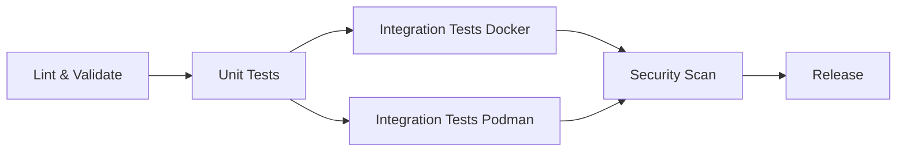

# CI/CD Documentation

## Overview

Claude Code Monitoring uses GitHub Actions for continuous integration and deployment. The CI/CD pipeline ensures code quality, test coverage, and security across multiple platforms and container runtimes.

## Pipeline Architecture

### Workflow Structure

```yaml
name: Test Suite
on:
  push:
    branches: [ main, develop, 'feature/*' ]
  pull_request:
    branches: [ main ]
  workflow_dispatch:
```

### Job Dependencies



## GitHub Actions Workflows

### Main Test Workflow (.github/workflows/test.yml)

#### 1. Test Matrix

Tests run on multiple configurations:

```yaml
strategy:
  fail-fast: false
  matrix:
    os: [ubuntu-latest, macos-latest]
    include:
      - os: ubuntu-latest
        container_runtime: docker
      - os: macos-latest
        container_runtime: docker
```

#### 2. Dependency Installation

Platform-specific dependency installation:

```yaml
# Ubuntu/Debian
- name: Install dependencies (Ubuntu)
  if: matrix.os == 'ubuntu-latest'
  run: |
    sudo apt-get update
    sudo apt-get install -y bats shellcheck yamllint
    pip install yamllint
    
    # Install kcov for coverage
    sudo apt-get install -y cmake binutils-dev libcurl4-openssl-dev
    # ... kcov build steps

# macOS
- name: Install dependencies (macOS)
  if: matrix.os == 'macos-latest'
  run: |
    brew install bats-core shellcheck
    pip install yamllint
```

#### 3. Test Execution Stages

**Stage 1: Linting**
```yaml
- name: Run ShellCheck
  run: |
    shellcheck -e SC1091 manage.sh check-claude-metrics.sh \
               update-wsl-ip.sh test-runner.sh

- name: Run yamllint
  run: |
    yamllint -d relaxed docker-compose.yaml
    yamllint -d relaxed prometheus.yml.template || true
    yamllint -d relaxed grafana-provisioning/**/*.yml || true
```

**Stage 2: Unit Tests**
```yaml
- name: Run BATS unit tests
  run: |
    ./test-runner.sh --unit-only --verbose
```

**Stage 3: Full Test Suite**
```yaml
- name: Run complete test suite
  run: |
    ./test-runner.sh --verbose
```

**Stage 4: Integration Tests**
```yaml
docker-test:
  name: Docker Integration Test
  runs-on: ubuntu-latest
  needs: test
  
  steps:
    - name: Test Docker Compose setup
      run: |
        ./manage.sh configure
        docker compose config
        
    - name: Test container startup
      run: |
        ./manage.sh up -d
        sleep 30
        ./manage.sh ps
        curl -f http://localhost:9090/-/ready
        curl -f http://localhost:3000/api/health
        ./manage.sh down
```

#### 4. Security Scanning

```yaml
security-scan:
  name: Security Scan
  runs-on: ubuntu-latest
  
  steps:
    - name: Run Trivy vulnerability scanner
      uses: aquasecurity/trivy-action@master
      with:
        scan-type: 'fs'
        scan-ref: '.'
        format: 'sarif'
        output: 'trivy-results.sarif'
```

### Release Workflow (.github/workflows/release.yml)

```yaml
name: Release
on:
  push:
    tags:
      - 'v*'

jobs:
  release:
    runs-on: ubuntu-latest
    steps:
      - name: Create Release
        uses: actions/create-release@v1
        with:
          tag_name: ${{ github.ref }}
          release_name: Release ${{ github.ref }}
          draft: false
          prerelease: false
```

## Running CI Checks Locally

### Simulating CI Environment

```bash
# Set CI environment variable
export CI=true

# Run tests as CI would
./test-runner.sh --verbose

# Run specific CI job locally
act -j test -P ubuntu-latest=ghcr.io/catthehacker/ubuntu:act-latest
```

### Pre-commit Hooks

Install pre-commit hooks to catch issues before CI:

```bash
#!/bin/bash
# .git/hooks/pre-commit

# Run linting
shellcheck -e SC1091 *.sh || exit 1
yamllint -d relaxed *.yaml *.yml || exit 1

# Run quick tests
./test-runner.sh --unit-only || exit 1

echo "Pre-commit checks passed!"
```

### Local CI Script

```bash
#!/bin/bash
# ci-local.sh - Run CI checks locally

set -e

echo "=== Running Local CI Checks ==="

# 1. Dependency check
echo "Checking dependencies..."
command -v bats >/dev/null || echo "WARNING: bats not installed"
command -v shellcheck >/dev/null || echo "WARNING: shellcheck not installed"
command -v yamllint >/dev/null || echo "WARNING: yamllint not installed"

# 2. Linting
echo "Running linters..."
shellcheck -e SC1091 *.sh
yamllint -d relaxed *.yaml *.yml

# 3. Unit tests
echo "Running unit tests..."
./test-runner.sh --unit-only

# 4. Integration tests
echo "Running integration tests..."
if command -v docker >/dev/null; then
    ./manage.sh up -d
    sleep 30
    curl -f http://localhost:9090/-/ready
    curl -f http://localhost:3000/api/health
    ./manage.sh down
else
    echo "Docker not available, skipping integration tests"
fi

echo "✅ All local CI checks passed!"
```

## CI Pipeline Optimization

### Caching Strategies

```yaml
# Cache dependencies
- name: Cache BATS
  uses: actions/cache@v3
  with:
    path: ~/.bats
    key: ${{ runner.os }}-bats-${{ hashFiles('**/test*.bats') }}

# Cache Docker layers
- name: Set up Docker Buildx
  uses: docker/setup-buildx-action@v3
  with:
    buildkitd-flags: --debug
    driver-opts: |
      image=moby/buildkit:latest
      network=host
```

### Parallel Execution

```yaml
# Run tests in parallel
test:
  strategy:
    matrix:
      test-suite: [unit, integration, lint]
  
  steps:
    - name: Run ${{ matrix.test-suite }} tests
      run: |
        case "${{ matrix.test-suite }}" in
          unit) ./test-runner.sh --unit-only ;;
          integration) ./test-runner.sh --integration ;;
          lint) ./test-runner.sh --lint-only ;;
        esac
```

### Fast Fail Configuration

```yaml
# Stop on first failure in PRs
strategy:
  fail-fast: ${{ github.event_name == 'pull_request' }}
```

## Debugging CI Failures

### Accessing CI Logs

```bash
# Download artifacts
gh run download <run-id>

# View specific job logs
gh run view <run-id> --log

# Re-run failed jobs
gh run rerun <run-id> --failed
```

### Common CI Issues

#### 1. Timeout Issues
```yaml
- name: Test with extended timeout
  timeout-minutes: 30  # Default is 6 hours
  run: |
    export INTEGRATION_TEST_TIMEOUT=300
    ./test-runner.sh --integration
```

#### 2. Platform-Specific Failures
```yaml
- name: Debug platform info
  run: |
    echo "OS: ${{ matrix.os }}"
    echo "Runner: ${{ runner.os }}"
    uname -a
    docker version || echo "Docker not available"
    podman version || echo "Podman not available"
```

#### 3. Resource Constraints
```yaml
- name: Check available resources
  run: |
    df -h
    free -m || vm_stat
    docker system df || true
```

### Debug Mode

Enable debug logging in workflows:

```yaml
env:
  ACTIONS_STEP_DEBUG: true
  ACTIONS_RUNNER_DEBUG: true
```

Or for specific steps:

```yaml
- name: Run tests with debug
  run: |
    DEBUG=1 ./test-runner.sh --verbose
  env:
    DEBUG: 1
```

## CI/CD Best Practices

### 1. Fast Feedback

- Run quick checks first (linting, unit tests)
- Use fail-fast for PR builds
- Cache dependencies aggressively

### 2. Comprehensive Testing

- Test on all supported platforms
- Include security scanning
- Verify documentation builds

### 3. Reliable Builds

- Pin dependency versions
- Use retry logic for flaky operations
- Set reasonable timeouts

### 4. Clear Reporting

```yaml
# Upload test reports
- name: Upload test results
  if: always()
  uses: actions/upload-artifact@v4
  with:
    name: test-results-${{ matrix.os }}
    path: |
      test-report.txt
      coverage/
      *.log
```

### 5. Security

```yaml
# Scan for secrets
- name: Secret scanning
  uses: trufflesecurity/trufflehog@main
  with:
    path: ./
    base: ${{ github.event.repository.default_branch }}
```

## Monitoring CI/CD

### GitHub Actions Status

```bash
# Check workflow runs
gh run list

# Monitor specific workflow
gh run watch

# Get workflow statistics
gh api repos/:owner/:repo/actions/runs \
  --jq '.workflow_runs | group_by(.conclusion) | 
        map({conclusion: .[0].conclusion, count: length})'
```

### CI Performance Metrics

Track and optimize CI performance:

```bash
# Average workflow duration
gh api repos/:owner/:repo/actions/runs \
  --jq '[.workflow_runs[] | 
         select(.status=="completed") | 
         .run_duration_ms] | 
         add/length/1000 | 
         "Average duration: \(.) seconds"'
```

## Future Improvements

### Planned Enhancements

1. **Matrix Expansion**
   - Add Windows runners
   - Test more OS versions
   - Include ARM architectures

2. **Advanced Testing**
   - Mutation testing
   - Fuzz testing
   - Performance benchmarks

3. **Deployment Automation**
   - Automated releases
   - Container image publishing
   - Documentation deployment

4. **Monitoring**
   - CI/CD metrics dashboard
   - Failure notifications
   - Cost tracking

### Experimental Features

```yaml
# Self-hosted runners
runs-on: [self-hosted, linux, x64]

# Reusable workflows
uses: ./.github/workflows/reusable-test.yml
with:
  os: ubuntu-latest
  
# Environment protection
environment:
  name: production
  rules:
    - type: required_reviewers
      reviewers: [maintainers]
```

## Conclusion

The CI/CD pipeline for Claude Code Monitoring provides comprehensive testing across platforms, ensuring code quality and reliability. Regular monitoring and optimization of the pipeline helps maintain fast feedback cycles and high confidence in releases.