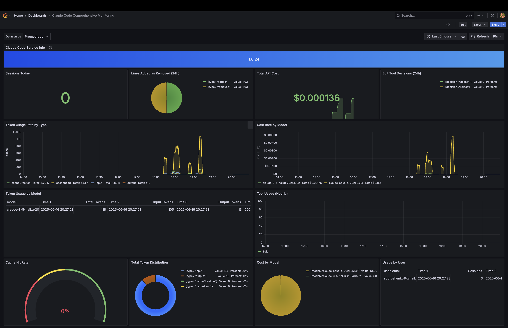
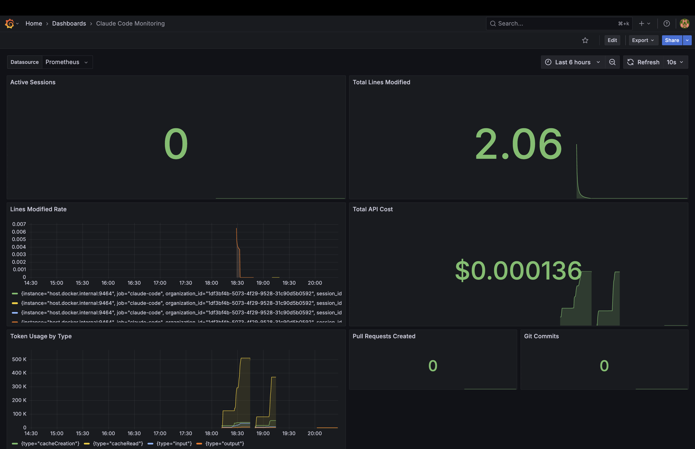

# Claude Code Monitoring 📊

[](https://opensource.org/licenses/MIT)
[](https://podman.io)
[](https://www.docker.com/)
[](https://prometheus.io/)
[](https://grafana.com/)

**Claude Code Comprehensive Monitoring**



**Claude Code Monitoring**



A comprehensive local monitoring solution for [Claude Code](https://docs.anthropic.com/en/docs/claude-code) usage metrics using Prometheus and Grafana.

# Claude Code Monitoring 🧑‍💻

[](https://opensource.org/licenses/MIT)
[](https://www.docker.com/)
[](https://podman.io/)
[](https://prometheus.io/)
[](https://grafana.com/)

A comprehensive, private, and flexible solution for locally monitoring [Claude Code](https://docs.anthropic.com/en/docs/claude-code) usage metrics using Prometheus and Grafana.

## Key Features

  - ✨ **One-Command Startup:** A single `./manage.sh` script automatically configures and launches the entire stack.
  - ⚙️ **Docker and Podman Support:** Automatically detects your environment for maximum compatibility.
  - 🐧 **Cross-Platform Configuration:** Automatic network configuration for Linux, macOS, and WSL.
  - 📊 **Pre-configured Dashboards:** Two ready-to-use Grafana dashboards for immediate analysis.
  - 🔒 **Privacy First:** All your data remains exclusively on your local machine.
  - 💰 **Cost Tracking:** Analyze API request costs across different models.
  - 📈 **Token Analytics:** Detailed breakdown of token usage, including cache efficiency.

## Quick Start

1. **Make the script executable:**
   ```bash
   chmod +x manage.sh
   ```

2. **Launch the monitoring stack:**

    ```bash
    ./manage.sh up
    ```

    The script will automatically:

    - Detect your container engine (Docker or Podman)
    - Create necessary configuration files
    - Set up Prometheus and Grafana with pre-configured dashboards
3. **Access the monitoring interfaces:**

    - **Grafana:** http://localhost:3000
        - Default login: `admin`
        - Default password: `changeme` (change it in `.env` file)
    - **Prometheus:** http://localhost:9090
4. **Configure Claude Code for monitoring:**

    Set the required environment variables before running Claude Code:

    ```bash
    # Required: Enable telemetry
    export CLAUDE_CODE_ENABLE_TELEMETRY=1

    # Required: Use Prometheus exporter
    export OTEL_METRICS_EXPORTER=prometheus

    # Optional: Bind to all interfaces (default is localhost)
    export OTEL_EXPORTER_PROMETHEUS_HOST=0.0.0.0

    # Optional: Change default port (default is 9464)
    export OTEL_EXPORTER_PROMETHEUS_PORT=9464

    # Optional: Set metric export interval in milliseconds (default is 60000)
    export OTEL_METRIC_EXPORT_INTERVAL=10000

    # Run Claude Code
    claude
    ```

5. **Verify metrics collection:**

    ```bash
    # Check if metrics are being exposed
    ./check-claude-metrics.sh
    ```

## How It Works: Architecture and Philosophy

This project was built with the developer community in mind. Our goal is to provide a powerful yet simple-to-use monitoring tool that "just works" across different systems, based on three key principles: **Simplicity**, **Reliability**, and **Flexibility**.

### 1\. Single Management Script (`manage.sh`)

Instead of a collection of different scripts, we have implemented a single entry point: `./manage.sh`. This central control panel automates all complex logic:

  - **Automatic Environment Detection:** The script independently checks whether you are using **Docker** or **Podman** and applies the appropriate startup logic.
  - **On-the-Fly Configuration:** On the first run of the `up` command, the script automatically:
      - Creates an `.env` file to securely manage the Grafana password.
      - Generates working configurations for Prometheus and Grafana from templates, automatically substituting the correct network settings for your OS (WSL, macOS, or Linux).

### 2\. Two Operating Modes: Flexibility and Reliability

We support the two most popular container engines, giving users a choice.

#### 🥇 **Podman Mode (Imperative Approach)**

This is a modern approach that we have implemented with a focus on maximum reliability, especially on macOS.

  - **Architecture:** We use direct `podman pod create` and `podman run` commands. This gives full control over pod creation and port publishing. All services run within a single **Pod**, allowing them to communicate with each other via `localhost`, which enhances security and simplifies configuration.

#### 🥈 **Docker Mode (Declarative Approach)**

This is the classic, time-tested approach that uses `docker-compose.yml`.

  - **Architecture:** Each service runs in a separate container, but they are connected by a common virtual network.
  - **Reliability:** We use `healthcheck` for Prometheus and `depends_on` for Grafana to ensure the correct startup order and service readiness.

### 3\. Pre-configured Dashboards and Data Persistence

  - **Grafana Provisioning:** On first launch, Grafana automatically configures its connection to Prometheus and imports all pre-configured dashboards. You don't need to set up anything manually.
  - **Persistent Storage:** Prometheus data (collected metrics) and Grafana data (your settings, custom dashboards) are stored in named volumes. This means your data will not be lost after stopping and restarting the stack with the `down` and `up` commands. A full wipe occurs only with the `clean` command.

## Stack Management

Use `./manage.sh` with the following commands:

| Command   | Description                                                               |
| :-------- | :------------------------------------------------------------------------ |
| `up`      | Launches the monitoring stack.                                            |
| `down`    | Stops and removes the containers/pod.                                     |
| `clean`   | **Completely wipes the system** (removes containers/pod and data volumes).|
| `restart` | Restarts the stack (runs `down` then `up`).                               |
| `reset`   | Restarts the Podman virtual machine (for macOS/Windows only).             |
| `logs`    | Tails the logs of all services in real-time.                              |
| `ps`      | Shows the status of the project's containers/pod.                         |
| `help`    | Displays this help information.                                           |

## Troubleshooting

### No metrics in Grafana?

1. **Check Claude Code metrics endpoint:**

    ```bash
    curl http://localhost:9464/metrics | grep claude_code
    ```

2. **Verify Prometheus targets:**

    - Go to http://localhost:9090/targets
    - Check if `claude-code` target is UP
3. **For WSL users:**

    - The script automatically detects WSL IP
    - If IP changes, restart the stack: `./manage.sh restart`
4. **Run diagnostics:**

    ```bash
    ./check-claude-metrics.sh
    ```

### `ERR_CONNECTION_REFUSED` on macOS

If you cannot access `localhost:3000`, perform a full reset:
```bash
./manage.sh clean
./manage.sh reset # This command will restart the Podman network stack
./manage.sh up
```
